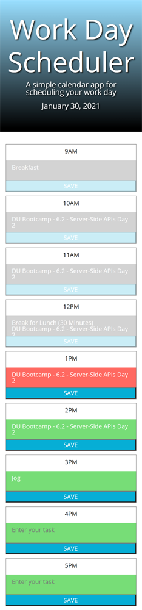
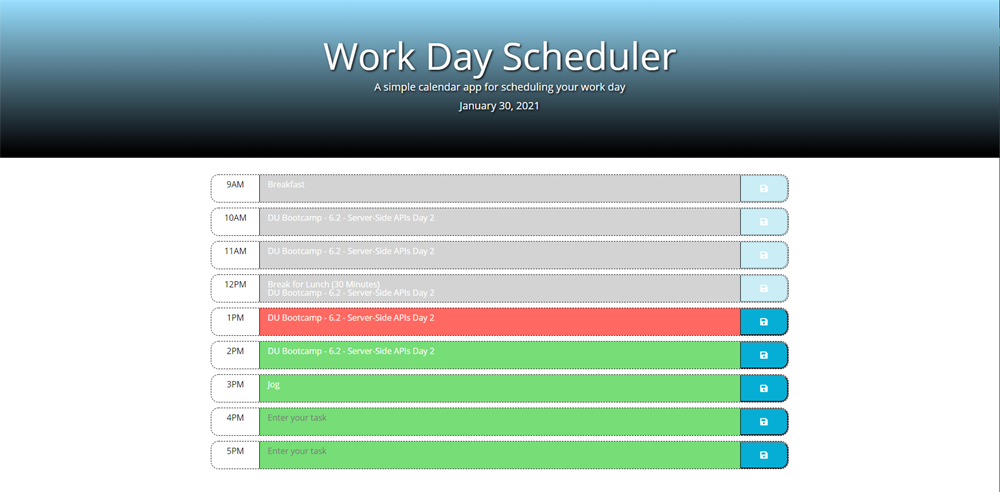

# Work-Day_Scheduler

For this assignment, I was tasked with creating a simple calendar application that allows a user to save events for each hour of the day. This app runs in the browser and features dynamically updated HTML and CSS powered by jQuery.

I used the [Luxon](https://moment.github.io/luxon/) API to access dates and times to power the dynamic pieces of this application. 

Below is the criteria I was to meet:

    * When the user opens the planner the current day is displayed at the top of the calendar
    * When the user scrolls down, they are presented with time blocks for standard business hours (9AM - 5PM)
    * When the user views the time blocks for that day each time block is color-coded to indicate whether it is in the past, present, or future
    * WHEN the user clicks into a time block, they can enter an event
    * When the user clicks the save button for that time block the text for that event is saved in local storage
    * When the user refreshes the page the saved events persist

There were also some modifications I added that I felt could be an improvement over the basic criteria. Below is the functionality I included:

    * The current date is stored in Local Storage. When a new day begins, if the page is revisited (or refreshed if left open) - The date in Local Storage is updated, and all saved tasks in Local Storage are cleared, making a clear planner for the new day
    * When a time block is in the "past" state, the Textarea and the Save Button are disabled so previous tasks are store and can't be overwritten
    * The layout was changed for smaller device sizes. I did not like how the time blocks aligned on smaller screen widths
    * The current date is displayed in the title, visible in the Browser tab

## Deployed Application Link:

https://bahuisken.github.io/Work-Day-Scheduler/

## Screenshots

- Mobile

- Desktop

## License

No License